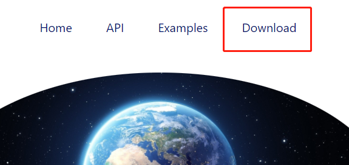

# Time Turner

#### The link to the landing page: [Time Turner](https://chenho2000.github.io/Time-Turner/pub/index.html)


## GETTING STARTED

## 1. Download the Library

To get started with Time-Turner, follow these steps:

### Download "Time-Turner.zip"

1. **Download**: Visit the website and navigate to the download section.
   - Click on "Download" on the navbar to obtain the "Time-Turner.zip" file.
   
   
### Decompress and Move Files

2. **Decompress**: Decompress the downloaded file to obtain a folder named "Time-Turner".
   - Inside this folder, you'll find the `src` directory along with the `Time-Turner.js` file, which is the library file.

3. **Move Files**: 
   - You have the option to either move the entire "Time-Turner" folder or just the `src` directory and the `Time-Turner.js` file to your working directory.
   - Ensure that the `src` directory and the JS file are kept together in the same path. 
   - It's strongly recommended to move the entire folder, especially if you already have a `src` folder in your project workspace. 
   - No external library installation is required for Time-Turner.

## 2. Setup the Library in HTML

Once you've downloaded the library, you need to integrate it into your HTML files:

### Add Script to HTML
- Insert the following line of code into the `<head>` section of your HTML file. Make sure to adjust the path according to the location of your `Time-Turner.js` file.
```
<script> defer type="text/javascript" src="./Time-Turner.js" </script>
```
Here, the src attribute should point to the location where you've placed your Time-Turner.js file.

## 3. Start Using the Library
You're now all set to start using the Time-Turner library. To ensure correct usage, please refer to the instructions provided in the documentation and API page. Additionally, explore the example page for detailed information on implementation.

Happy Time-Turning!

#### The link to documentation and API page: [documentation and API](https://chenho2000.github.io/Time-Turner/pub/API.html)
